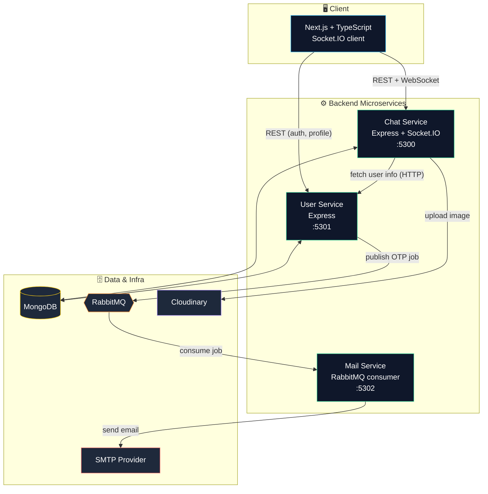
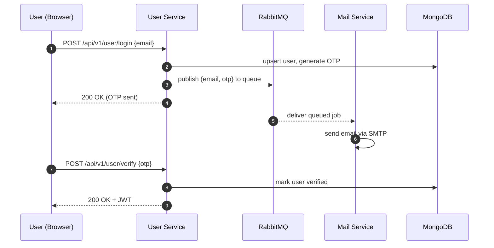
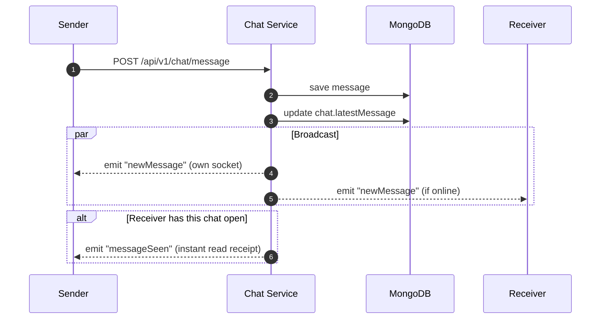
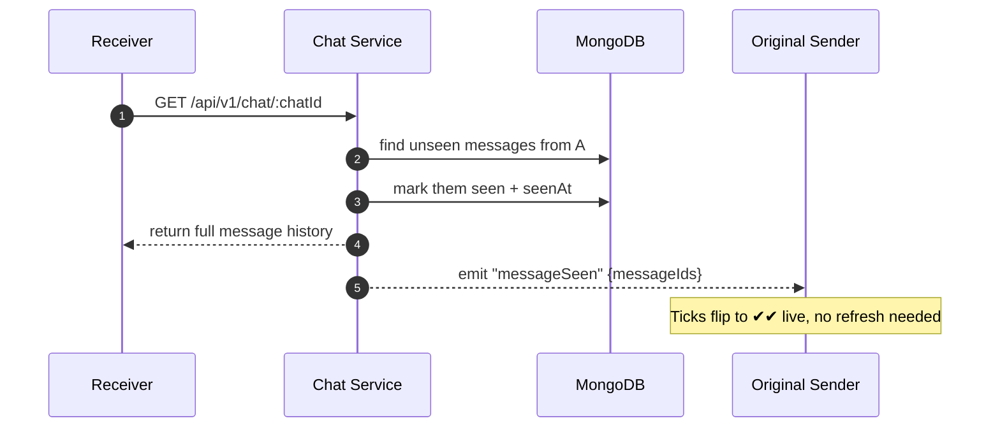
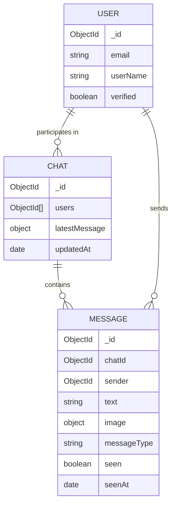

<div align="center">

# 💬 Microservices Chat Application

A real-time chat app built on a **microservices architecture** — independent services for chat, users, and mail, talking to each other over HTTP, **RabbitMQ**, and **Socket.IO**.

[](https://nextjs.org/)
[](https://www.typescriptlang.org/)
[](https://nodejs.org/)
[](https://socket.io/)
[](https://www.mongodb.com/)
[](https://www.rabbitmq.com/)

</div>

---

## ✨ Features

- 🔐 **JWT authentication** with OTP-based email verification
- 💬 **Real-time messaging** over Socket.IO, with text and image messages
- ⌨️ **Typing indicators** and **live online/offline presence**
- ✅ **Read receipts** (double-tick, seen timestamp) that update live
- 🖼️ **Image uploads** via Cloudinary
- 🧩 **True microservices** — chat, user, and mail are independently deployable services, each with its own database and responsibilities
- 📨 **Async, decoupled email delivery** — the mail service consumes jobs from RabbitMQ instead of being called directly

---

## 🏗️ Architecture Overview

The frontend never talks to the mail service directly, and the user service never sends email itself — it just publishes a job to a queue and moves on. That decoupling is the core idea of the whole system.



**Why split it this way?**
- **Chat Service** owns real-time state — it's the only service holding a live Socket.IO connection map, so all real-time events (messages, typing, presence, seen receipts) route through it.
- **User Service** owns identity — auth, profile, OTP verification — and stays completely unaware of chat/message data.
- **Mail Service** does one job: drain a queue and send email. It has no HTTP API of its own; it only reacts to RabbitMQ messages, so it can be scaled or restarted independently without affecting login or chat.

---

## 🔄 Request & Data Flow

### 1. Signup → OTP email (async, via RabbitMQ)



The user service responds to the browser **as soon as the job is queued** — it doesn't wait for the email to actually send. That's the whole point of putting RabbitMQ in between: a slow or temporarily-down SMTP provider can never slow down or fail a login request.

### 2. Sending a message, in real time



### 3. Read receipts when opening a chat later



---

## 🧬 Core Data Model



`User` documents live in the **user service's** database; `Chat` and `Message` documents live in the **chat service's** database. There's no shared database — services only ever learn about each other's data over HTTP or RabbitMQ, never via a shared table/collection. That's what makes this a real microservices setup rather than one app split into folders.

---

## 📁 Project Structure

```
Microservices-Chat-Application/
├── frontend/                 # Next.js + TypeScript + Tailwind CSS
│   └── src/
│       ├── app/               # Routes (login, chat, profile)
│       ├── components/        # ChatSidebar, ChatMessages, MessageInput, ...
│       └── context/            # AppContext (user/chat state), SocketContext
│
└── backend/
    ├── chat-service/          # Messaging, Socket.IO, read receipts, uploads
    ├── user-service/          # Auth, OTP verification, profile
    └── mail-service/          # RabbitMQ consumer → sends transactional email
```

---

## 🚀 Getting Started

### Prerequisites

- Node.js 18+
- MongoDB (local or Atlas)
- Redis
- RabbitMQ (local, or a hosted instance like CloudAMQP)
- A Cloudinary account (for image uploads)
- An SMTP provider (e.g. Gmail App Password, Mailtrap, Resend)

### 1. Clone and install

```bash
git clone https://github.com/<your-username>/Microservices-Chat-Application.git
cd Microservices-Chat-Application

# install each service separately — they are independent Node projects
cd backend/chat-service && npm install && cd ../..
cd backend/user-service && npm install && cd ../..
cd backend/mail-service && npm install && cd ../..
cd frontend && npm install && cd ..
```

### 2. Configure environment variables

Each backend service has its own `.env.example` — copy each one to `.env` in the same folder and fill in real values. **Never commit the real `.env` files**; only `.env.example` should be tracked in git.

```bash
cp backend/chat-service/.env.example backend/chat-service/.env
cp backend/user-service/.env.example backend/user-service/.env
cp backend/mail-service/.env.example backend/mail-service/.env
```

<details>
<summary><strong>⚙️ backend/chat-service/.env</strong></summary>

| Variable | Description |
|---|---|
| `PORT` | Port the service listens on (default `5300`) |
| `MONGO_URI` | MongoDB connection string for chat & message data |
| `REDIS_URI` | Redis connection string |
| `JWT_SECRET` | Secret used to verify incoming JWTs — **must match** `user-service`'s secret |
| `USER_SERVICE_URL` | Base URL of the user service (e.g. `http://localhost:5301`), used for internal user lookups |
| `CLOUDINARY_CLOUD_NAME` | Cloudinary account cloud name |
| `CLOUDINARY_API_KEY` | Cloudinary API key |
| `CLOUDINARY_API_SECRET` | Cloudinary API secret |
| `SERVICE_NAME` | Human-readable name used in logs |
| `NODE_ENV` | `development` or `production` |

</details>

<details>
<summary><strong>⚙️ backend/user-service/.env</strong></summary>

| Variable | Description |
|---|---|
| `PORT` | Port the service listens on (default `5301`) |
| `MONGO_URI` | MongoDB connection string for user data |
| `REDIS_URI` | Redis connection string |
| `RABBITMQ_HOST` | RabbitMQ host |
| `RABBITMQ_USERNAME` | RabbitMQ username |
| `RABBITMQ_PASSWORD` | RabbitMQ password |
| `RABBITMQ_PORT` | RabbitMQ port (default `5672`) |
| `JWT_SECRET` | Secret used to sign JWTs — **must match** `chat-service`'s secret |
| `SERVICE_NAME` | Human-readable name used in logs |
| `NODE_ENV` | `development` or `production` |

</details>

<details>
<summary><strong>⚙️ backend/mail-service/.env</strong></summary>

| Variable | Description |
|---|---|
| `PORT` | Port the service listens on (default `5302`) |
| `SERVICE_NAME` | Human-readable name used in logs |
| `NODE_ENV` | `development` or `production` |
| `RABBITMQ_HOST` | RabbitMQ host — **must match** `user-service`'s RabbitMQ config |
| `RABBITMQ_USERNAME` | RabbitMQ username |
| `RABBITMQ_PASSWORD` | RabbitMQ password |
| `RABBITMQ_PORT` | RabbitMQ port |
| `SMTP_USER` | SMTP account username / sender address |
| `SMTP_PASS` | SMTP account password / app password |

> The mail service refuses to start without `SMTP_USER` and `SMTP_PASS` set — it throws on boot rather than failing silently later.

</details>

> ⚠️ **`JWT_SECRET` must be identical** in `chat-service` and `user-service` — the chat service trusts tokens that were issued by the user service, so a mismatched secret will make every authenticated request to chat-service fail.

### 3. Run everything (each in its own terminal)

```bash
# Terminal 1
cd backend/user-service && npm run dev

# Terminal 2
cd backend/chat-service && npm run dev

# Terminal 3
cd backend/mail-service && npm run dev

# Terminal 4
cd frontend && npm run dev
```

Then open **http://localhost:3000**.

| Service | Default URL |
|---|---|
| Frontend | http://localhost:3000 |
| Chat Service | http://localhost:5300 |
| User Service | http://localhost:5301 |
| Mail Service | http://localhost:5302 (no public routes — consumer only) |

---

## 📡 API Reference

<details>
<summary><strong>User Service</strong> — <code>/api/v1/user</code></summary>

| Method | Route | Auth | Description |
|---|---|---|---|
| `POST` | `/login` | — | Start login/signup, sends OTP via mail service |
| `POST` | `/verify` | — | Verify OTP, returns JWT |
| `POST` | `/update/user` | ✅ | Update display name |
| `GET` | `/me` | ✅ | Get current logged-in user |
| `GET` | `/user/all` | ✅ | List all users |
| `GET` | `/user/:id` | — | Get a single user's public profile |

</details>

<details>
<summary><strong>Chat Service</strong> — <code>/api/v1/chat</code></summary>

| Method | Route | Auth | Description |
|---|---|---|---|
| `POST` | `/new` | ✅ | Start a new chat with another user |
| `POST` | `/all` | ✅ | Get all chats for the logged-in user |
| `POST` | `/message` | ✅ | Send a text or image message |
| `GET` | `/:chatId` | ✅ | Get message history for a chat (marks messages seen) |

</details>

**Socket.IO events**

| Event | Direction | Payload |
|---|---|---|
| `getOnlineUser` | server → client | `string[]` of online user IDs |
| `newMessage` | server → client | the saved message document |
| `messageSeen` | server → client | `{ chatId, seenBy, messageIds }` |
| `typing` / `stopTyping` | client ↔ server | `{ chatId }` |

---

## 🛠️ Tech Stack

| Layer | Tech |
|---|---|
| Frontend | Next.js, TypeScript, Tailwind CSS, Socket.IO Client |
| Backend | Node.js, Express, Socket.IO |
| Database | MongoDB + Mongoose |
| Caching | Redis |
| Messaging | RabbitMQ |
| Media | Cloudinary |
| Auth | JWT + OTP email verification |

---

## 📄 License

This project is open source and available for learning purposes.
